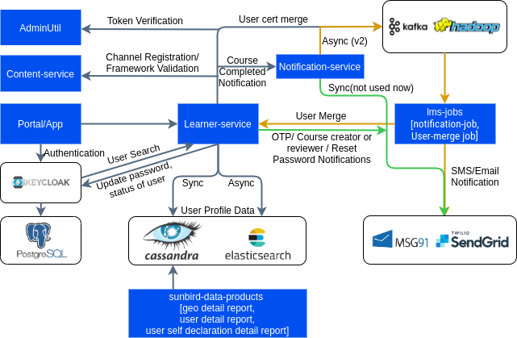

# USER & ORG SERVICE

This component consists of various services which support user authentication, API management and token generation, Samza jobs for asynchronous notification along with user and organisation management.

The table below lists out the various APIs that enable the various capabilities listed. Further documentation about these APIs and their details can be found in the respective API documents.

**API List:**

| SERVICE                    | DESCRIPTION | APIs                                                                                                                 |
| -------------------------- | ----------- | -------------------------------------------------------------------------------------------------------------------- |
| User accounts (CRUD)       |             | [http://docs.sunbird.org/latest/apis/userapi/](http://docs.sunbird.org/latest/apis/userapi/)                         |
| Organisations (CRUD)       |             | [http://docs.sunbird.org/latest/apis/orgapi/](http://docs.sunbird.org/latest/apis/orgapi/)                           |
| Location (CRUD)            |             | [http://docs.sunbird.org/latest/apis/locationapi/](http://docs.sunbird.org/latest/apis/locationapi/)                 |
| Consent Management         |             | [http://docs.sunbird.org/latest/apis/consentapi/](http://docs.sunbird.org/latest/apis/consentapi/)                   |
| OTP Services               |             | [http://docs.sunbird.org/latest/apis/otpapi/](http://docs.sunbird.org/latest/apis/otpapi/)                           |
| Notes Management           |             |                                                                                                                      |
| Tenant Configurations      |             | [http://docs.sunbird.org/latest/apis/tenantpreferenceapi/](http://docs.sunbird.org/latest/apis/tenantpreferenceapi/) |
| Backend Services           |             | [http://docs.sunbird.org/latest/apis/bulkupload/](http://docs.sunbird.org/latest/apis/bulkupload/)                   |
| 
 System Settings
 |             | [http://docs.sunbird.org/latest/apis/systemsettingsapi/](http://docs.sunbird.org/latest/apis/systemsettingsapi/)     |

### User & Org Service: 

This service provides a set of APIs to manage the user, organisation and location information.&#x20;

1. **Location** - It is mainly the geographical location of the organisation or user. Currently it supports - state, district, block, cluster location types.
2. **Organisation** - Supports tenant or non-tenant organisation. Tenant organisation has to have a channel and slug which is unique. Non-tenant organisations should have a channel which is having a tenant mapped to it. There should be a default organisation called ‘custodian’ created during setup.
3. **User** - User can be a LUA(Logged in User) or MUA(Managed User) user. LUA should have an email or phone number, which can be used for login. MUA will not have email and phone, their profile can be only used after logging in with LUA credentials. Each user should be mapped to custodian or other tenant orgs.&#x20;

**GitHub Repository:**

[GitHub - project-sunbird/sunbird-lms-service: API services for Learning management system of sunbird](https://github.com/project-sunbird/sunbird-lms-service)

**Last Released Version : **

release-4.3.0

&#x20;

### Authentication: 

This service is used to validate a user while authenticating using keycloak. Keycloak uses this internally to fetch user information from the User & Org Service.

**GitHub Repository: **

[GitHub - project-sunbird/sunbird-auth: Repository for sunbird authentication service](https://github.com/project-sunbird/sunbird-auth)

**Last Released Version : **

release-3.8.0

### API manager util: 

Wrapper for Kong admin util. This wrapper exposes APIs which can be used to register kong consumers and credentials. This service should not be exposed to the internet.

**GitHub Repository:**

[GitHub - project-sunbird/sunbird-apimanager-util: Wrapper for Kong admin util](https://github.com/project-sunbird/sunbird-apimanager-util)

**Last Released Version : **

release-4.3.0

### Background Jobs: 

This repository is for event driven jobs user in Sunbird User & Org Service

**GitHub Repository:**

[GitHub - project-sunbird/sunbird-lms-jobs: Repository for background jobs in Sunbird LMS](https://github.com/project-sunbird/sunbird-lms-jobs)

**Last Released Version : **

release-3.7.0
